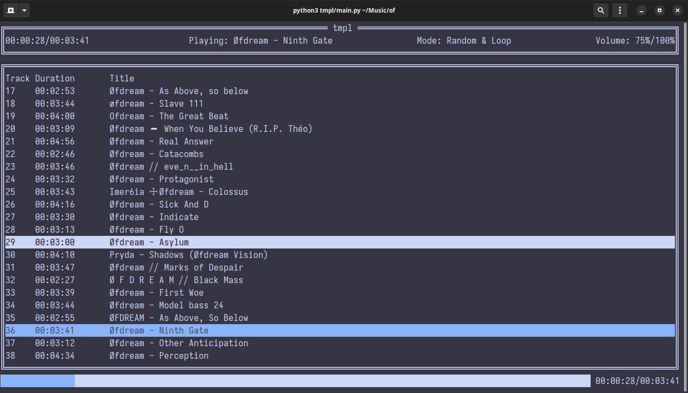

# tmpl

Minimalist music player for audio files with a pleasant UI.


## Installation

### PyPI

```
pip install tmpl2
```

### Manual

1. Clone the repository

```
git clone https://github.com/H4wk507/tmpl.git
```

2. Go into the directory and install

```
cd tmpl && pip install .
```

## Usage

Pass in directories/audio files as commandline arguments.

Example:

```
tmpl2 ~/Music/Rap/ sample.mp3 ...
```

## Key bindings

- arrow keys: Navigate
- enter: Play selected song
- space: Play/Pause
- n: Play the next song
- p: Play the previous song
- 1: Set default mode
- 2: Set loop mode
- 3: Set repeat mode
- r: Set random mode
- u: Increase volume by 5%
- d: Decrease volume by 5%
- q: Quit

## License

Licensed under the [MIT License](LICENSE).
